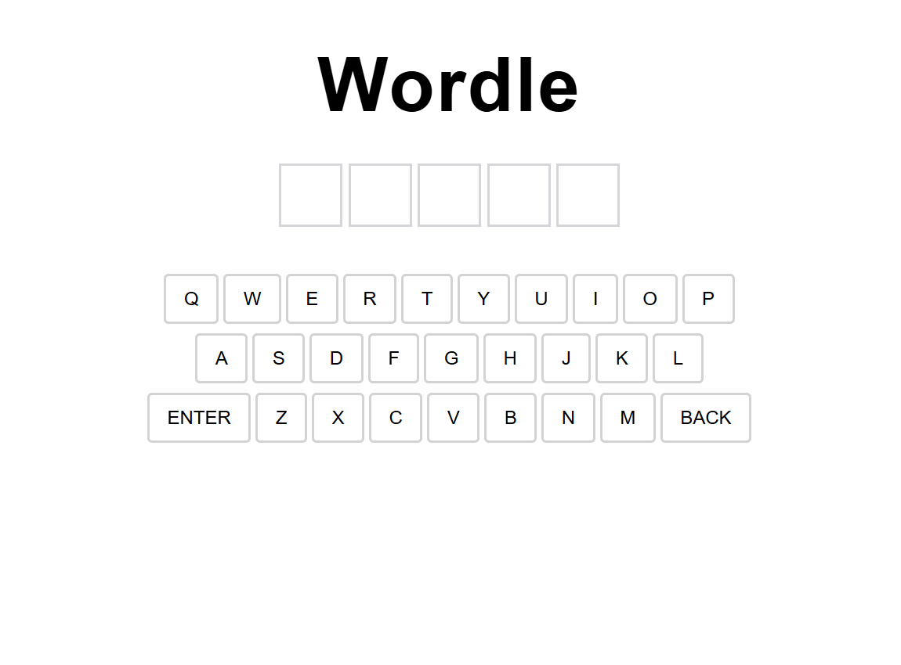
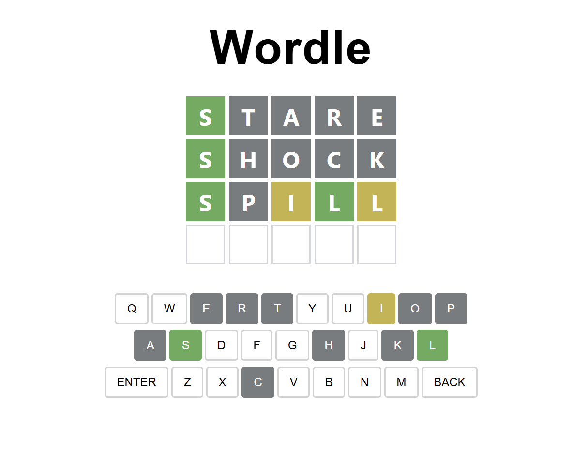
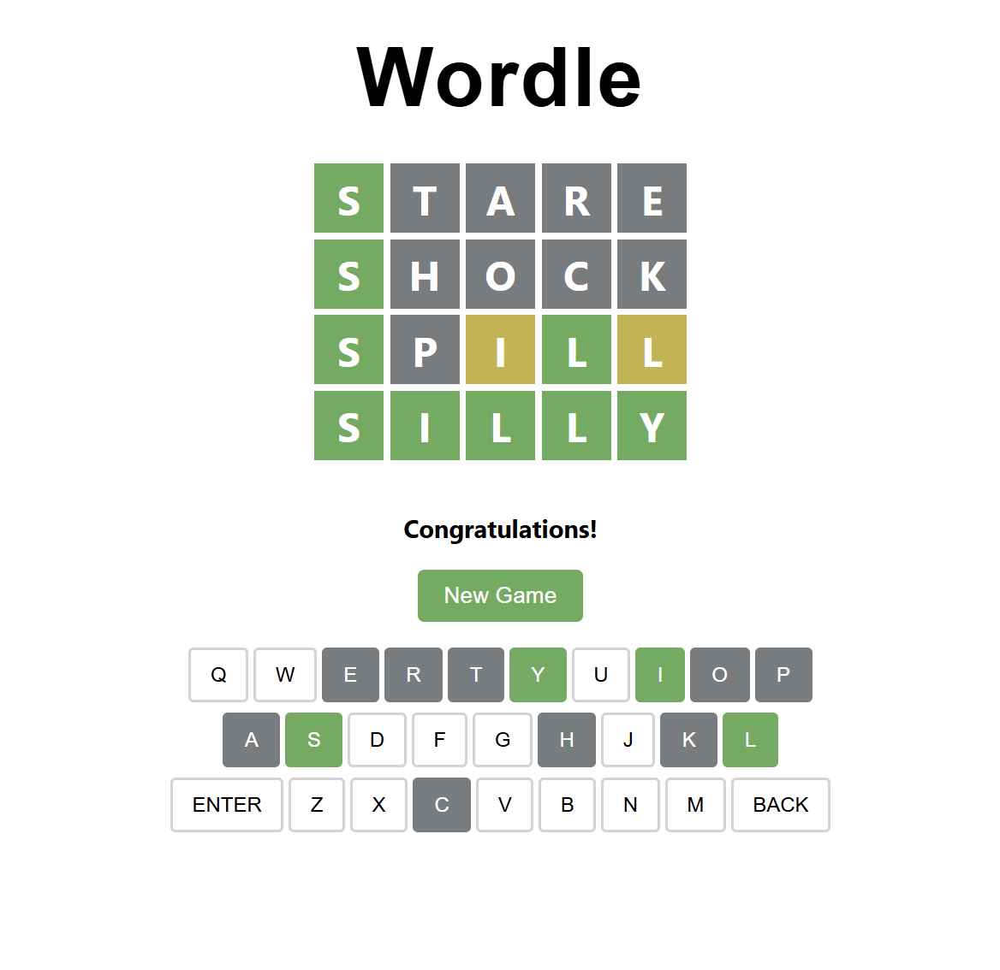

# Wordle Game (Full Stack)

A full-stack clone of the classic Wordle game, built using **Spring Boot (Java)** for the backend and **React** for the frontend. Players have 6 attempts to guess a 5-letter word, with real-time feedback and an interactive on-screen keyboard.

---

## Features

- 🎯 Game logic for checking word accuracy (correct, present, absent)
- ⌨️ On-screen keyboard with live feedback
- 📡 REST API to handle game state and guesses
- 📁 Preloaded word list from file
- 🎨 Responsive, styled UI with React & CSS
- 🔁 Full restart/reset game functionality
- 🧪 Robust backend logic with clear separation of concerns (Controller / Service / Model)

---

## 🛠 Tech Stack

**Frontend:**
- React
- JavaScript
- CSS

**Backend:**
- Java 17
- Spring Boot (Spring Web, Spring DevTools)
- REST API

**Other:**
- Maven
- Git & GitHub

---

## 📸 Screenshots




## 🔧 Getting Started

### 📦 Backend
1. From the root of the project, navigate to the backend folder:
    ```
    cd backend
    ```

2. Run the Spring Boot Application
    ```
    # Windows
    .\mvnw spring-boot:run
    ```
    ```
    # Mac/Linux
    ./mvnw spring-boot:run
    ```
    or use your IDE to run ```BackendApplication.java```

### 💻 Frontend

1. From the root of the project, navigate to the frontend folder:
    ```
    cd frontend
    ```
2. Install dependencies:
    ```
    npm install
    ```
3. Start the React app:
    ```
    npm start
    ```

## 🧩 Configuration
The application uses the following endpoints:

**🎮 Frontend Interface:**
- http://localhost:3000 - Web interface for playing the game

**⚙️ Backend API Endpoints:**
- POST http://localhost:8080/api/guess - Submit a guess
- POST http://localhost:8080/api/new-game - Start a new game

Note: The backend endpoints are POST-only APIs meant to be called from the frontend application, 
not accessed directly in a browser. All game interaction should be done through the frontend interface.

---

## ✅ Prerequisites
- Node.js (v16 or higher)
- Java 17 or higher
- Maven
- npm

---

## 🌟 Created by Jeff Starr